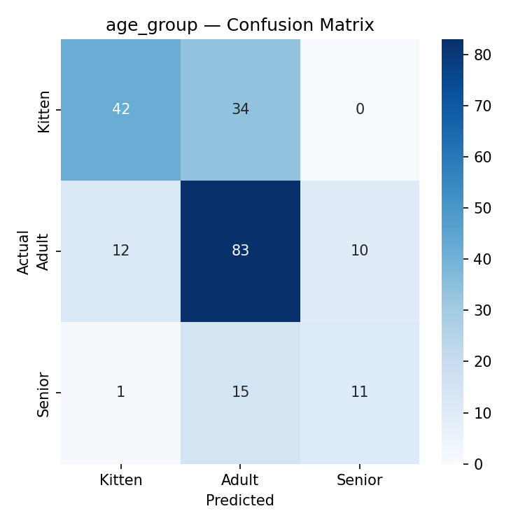
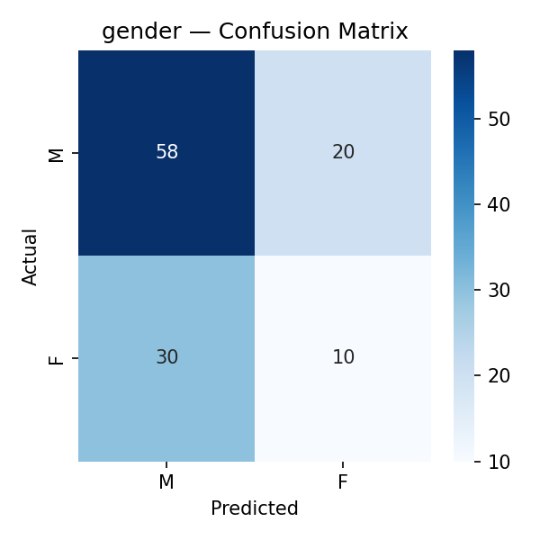

## Age Group Classification

### Best hyperparameters:

'n_components': 44

'n_layers': 1

'hidden_size': 256

'lr': 0.0005315193667214779

### Val set performance:

Best macro F1: 0.4841

### Test set performance:

| Class        | precision | recall | f1-score | support |
|--------------|-----------|--------|----------|---------|
| Kitten       | 0.76      | 0.55   | 0.64     | 76      |
| Adult        | 0.63      | 0.79   | 0.70     | 105     |
| Senior       | 0.52      | 0.41   | 0.46     | 27      |
| macro avg    | 0.64      | 0.58   | 0.60     | 208     |
| weighted avg | 0.66      | 0.65   | 0.65     | 208     |

accuracy: 0.65

## Age Regression

### Best hyperparameters:

'n_components': 41

'n_layers': 4

'hidden_size': 64

'lr': 0.00015852368378296605

### Val set performance:

Best MAE: 5.3630

### Test set performance:

MAE: 3.0430

RMSE: 3.9395

QWK: 0.5901

## Gender Classification

### Best hyperparameters:

'n_components': 50

'n_layers': 2

'hidden_size': 128

'lr': 0.0004530479974868457

### Val set performance:

Best 'Female' f1: 0.4912

### Test set performance:

| class        | precision | recall | f1-score | support |
|--------------|-----------|--------|----------|---------|
| M            | 0.66      | 0.74   | 0.70     | 78      |
| F            | 0.33      | 0.25   | 0.29     | 40      |
| macro avg    | 0.50      | 0.50   | 0.49     | 118     |
| weighted avg | 0.55      | 0.58   | 0.56     | 118     |

accuracy: 0.58

